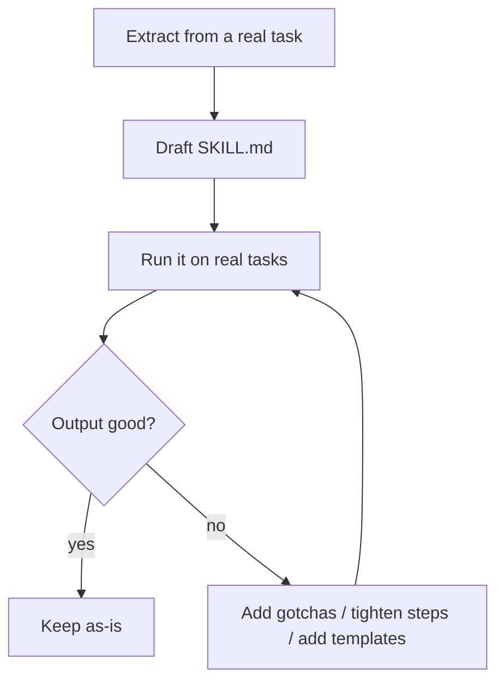
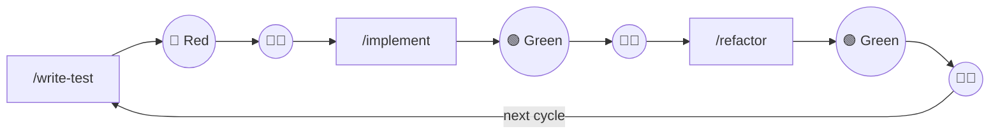

# Skills

---
layout: why
---

# Why Skills?

Skills are the next step beyond rules and commands — they package reusable prompts together with examples, scripts and assets so you can automate entire work routines.

- Rules give guidance · commands trigger one task — but real workflows need **more**: examples, scripts, structured assets
- Skills are the **latest standard** — a must-know for any team working with AI agents
- Once written, a Skill is reused automatically: no more copy-pasting instructions across conversations

---
layout: little-what
---

# What is a Skill?

A Skill automates everyday tasks by combining a structured prompt (`SKILL.md`) with scripts, references and assets — and you can chain Skills together to automate entire work routines.

---
layout: default
---

# Shape of `SKILL.md`

<WindowMockup codeblock title=".cursor/skills/github-issue/SKILL.md" padding="1rem">

```md{*|1,5|2-4|7|9-11|13-17|*}
---
name: github-issue
description: Analyse a GitHub Issue and draft a response.
  Use when the user mentions issues, bugs, or feature requests.
---

# GitHub Issue Skill

## When to Use

- User provides a GitHub issue URL or mentions an issue

## Instructions

1. Fetch the issue using scripts/fetch-issue.sh
2. Summarise the problem and suggest labels
3. Draft a comment using assets/issue-template.md
```

</WindowMockup>

---
layout: two-cols-header
layoutClass: gap-4
---

# Skill file structure

::left::

- **`SKILL.md`** — required; frontmatter + instructions
- **`scripts/`** — executable code (bash, python …) run by the agent
- **`references/`** — extra docs loaded on demand, zero cost until read
- **`assets/`** — templates, images, config files

<Callout type="info" class="mt-4">
<code>.cursor/skills/</code> project-level &nbsp;·&nbsp; <code>~/.cursor/skills/</code> user-level (global)
</Callout>

::right::

<WindowMockup codeblock title=".cursor/skills/" padding="1rem">

```text
.cursor/skills/
└── github-issue/
    ├── SKILL.md
    ├── scripts/
    │   └── fetch-issue.sh
    ├── references/
    │   └── REFERENCE.md
    └── assets/
        └── issue-template.md
```

</WindowMockup>

---
layout: default
---

# Progressive loading — three levels

- **Level 1 — Metadata** _(always, ~100 tokens)_: `name` + `description` from frontmatter — every installed Skill, zero context penalty
- **Level 2 — Instructions** _(when triggered, < 5 k tokens)_: full `SKILL.md` body loaded into context
- **Level 3 — Resources** _(as needed, unlimited)_: scripts, references, assets — read only when referenced

<br><br>

<Callout type="tip" v-click>
Many Skills installed = no context penalty. Scripts run via bash — their <strong>code never enters the context window</strong>, only their output does.
</Callout>

---
layout: sub-section
---

# Skill authoring best practices

---
layout: default
---

# Write Skills like good functions

- **Start from real expertise** — capture what *your team* does (not generic advice)
- **Design coherent units** — one workflow per Skill, composable with others
- **Spend context wisely** — add what the agent would otherwise get wrong
- **Provide defaults** — “use X”; “if Y, fall back to Z”

---
layout: two-cols-header
layoutClass: gap-4
---

# Spend context wisely

::left::

**Bad Skill text**

- Explains obvious basics (PDF, HTTP, Git…)
- Long prose instead of steps
- Loads everything up front

::right::

**Better Skill text**

- Focus on **gotchas** + project conventions
- Stepwise procedure + small examples
- Use `references/` for on-demand details

---
layout: default
---

# High-value patterns inside `SKILL.md`

- **Gotchas**: “things that defy reasonable assumptions” (prevent repeated mistakes)
- **Templates**: output structure (agent pattern-matches reliably)
- **Checklists**: multi-step workflows; reduce skipped steps
- **Validation loop**: do → validate → fix → re-validate

---
layout: default
---

# Process: extract → run → refine



---
layout: two-cols-header
layoutClass: gap-4
---

::left::

# Before

- Copy-paste instructions into every conversation
- Rewrite context and examples each time
- Forget edge cases, lose examples
- No structure — hard to share with the team

::right::

# After

- Call `/github-issue` — instructions, scripts and assets auto-loaded
- Consistent results every time
- Skills live in the repo — versioned, reviewable, shareable
- Chain Skills to automate full routines

---
layout: default
---

# Red-Green-Refactor — built with Skills

<br>



<br><br>

<Callout type="tip" v-click>
Each Skill owns one step. The developer stays in the loop at every transition.
</Callout>

---
layout: center
---

# Skills from the community for the community

> Vercel hosts a website, where you find existing skills for your workflows

https://skills.sh/

---
layout: task
---

# Task: Migrate to a Skill

---
layout: task
---

# Task: Requirements-Engineering Skill
